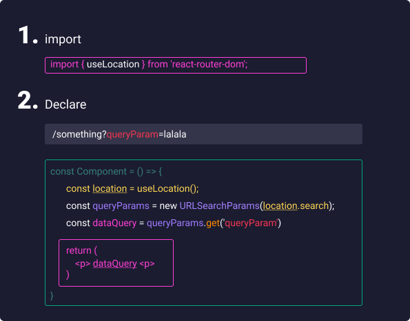

# React Summary
> HOOKS
## useState Hook 🎣
### The purpose of useState is to handle reactive data → any data that changes in the application it's call state → and when state changes you want react to update the UI

## useReducer Hook 🎣

## useContext Hook 🎣

> REDUX
## Redux + toolkit

## Redux custom action creator function
### is simply a function that delays an action until later (until something else finished)

> React Router
## Basic

## Query Parameters

## Redirect

## Not Found Page
```
  <Route path="*">
    //code to render
  </Route>
```
> OTHER
## Portals
### Portals provide a first-class way to render children into a DOM node that exists outside the DOM hierarchy of the parent component.


